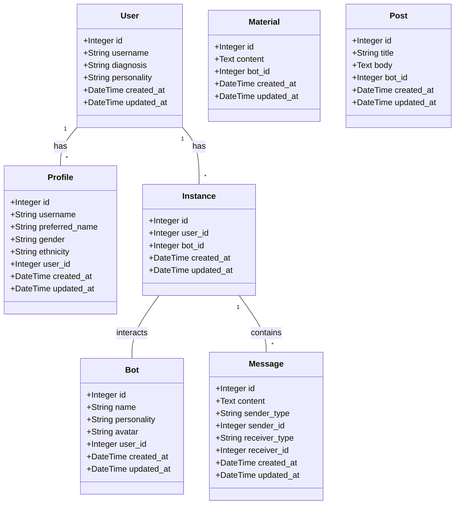

# Schema

# Keeping track of the project / Terminal History

Stage 1: Prep
Aim:  Basic navigation and elementory UI

10075  rails new . --force
10076  rails generate scaffold Post title:string body:text\n
10077  rails db:migrate\n
10078  rails db
10079  rails console
---
 The rails generate scaffold Post title:string body:text command, it generates a set of MVC components for a new resource in your Rails application named "Post". Here's a breakdown of the generated Model, View, and Controller components:

    Model: The model created is named Post. This model will have two attributes: title (a string) and body (a text). It'll create a file named post.rb under app/models.

    View: Several view files are generated for the Post model. They include index.html.erb, edit.html.erb, show.html.erb, and new.html.erb located in app/views/posts/. These views are used to display all posts (index), individual posts (show), the page to create a new post (new), and the page to edit a post (edit).

    Controller: The command generates a controller named PostsController with several actions including index, show, new, edit, create, update, and destroy. The controller file is named posts_controller.rb and it's found in app/controllers.
---
Inspiration is from Eliza, pseducode is.

function ELIZA GENERATOR(user sentence) returns response
   Let w be the word in sentence that has the highest keyword rank
   if w exists
       Let r be the highest ranked rule for w that matches sentence
       response ← Apply the transform in r to sentence
       if w = 'my'
           future ← Apply a transformation from the ‘memory’ rule list to sentence
           Push future onto the memory queue
       else (no keyword applies)
           Either
               response ← Apply the transform for the NONE keyword to sentence
           Or
               response ← Pop the oldest response from the memory queue
   Return response

Example: 
http://www.med-ai.com/models/eliza.html
view-source: https://web.njit.edu/~ronkowit/eliza.html

This repos aim is to surpas this code and pass the turing test 
---
10108  cd config/
10109  ls
10110  nano routes.rb

10136  rails generate model User username:string email:string\n
10137  rails generate model Profile user:references name:string gender:string ethnicity:string\n
10138  rails generate model Bot user:references name:string personality:string avatar:string\n
10139  rails generate model Instance user:references profile:references bot:references\n
10140  rails generate model Message user:references profile:references bot:references instance:references content:text\n
10141  rails generate model Material data:text\n
10142  rails db:migrate
rails db:seed